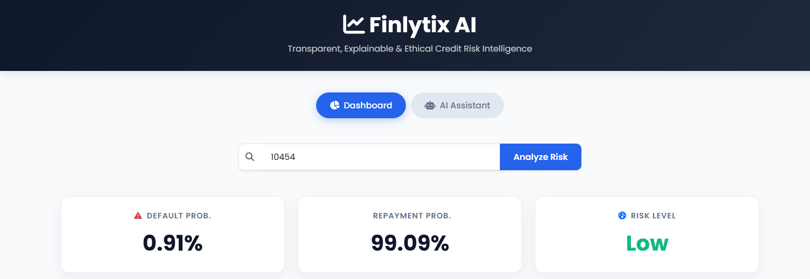
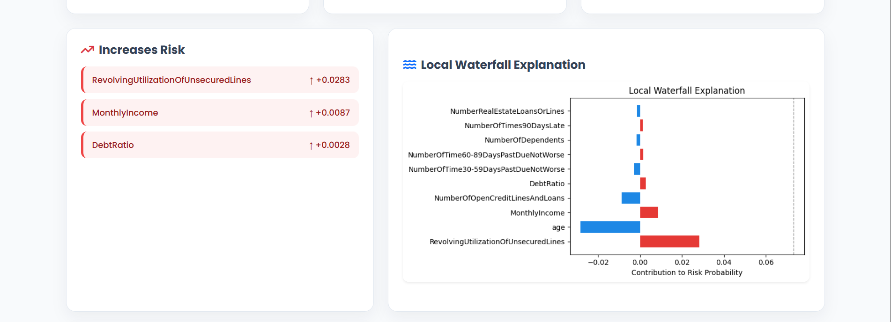
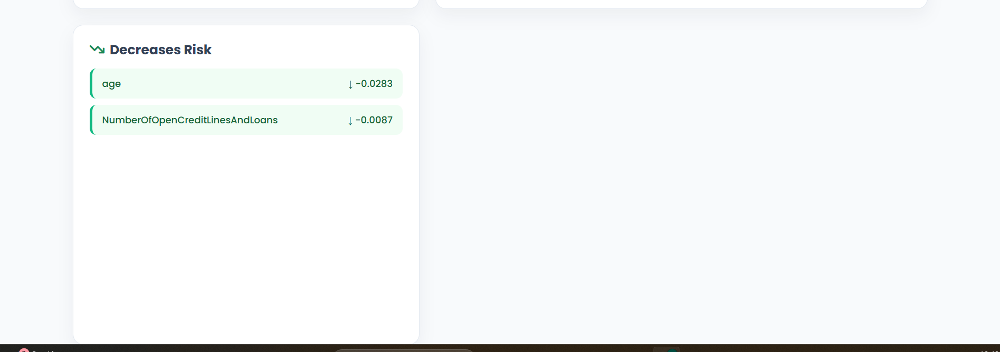

# 💰 Finlytix: AI Credit Risk Intelligence System

[](https://finlytix-project-3.onrender.com/)

An end-to-end **machine learning-powered credit risk assessment system** featuring explainable AI, an interactive dashboard, and a natural language query interface.

---

## 💡 Problem Statement
Financial institutions require reliable, unbiased systems to evaluate loan applicants and minimize default risk. Finlytix simulates a **real-world loan approval pipeline** using Machine Learning combined with Explainable AI (XAI) to not only predict risk but also transparently explain *why* a specific decision was made.

---

## 🚀 Key Features & Architecture
**Data Flow:** `Customer ID Input` ➔ `Data Retrieval` ➔ `XGBoost Inference` ➔ `SHAP Explanation Generation` ➔ `Streamlit UI`

* **Credit Risk Prediction:** Robust classification powered by an optimized XGBoost model.
* **Explainable AI (XAI):** Integration of SHAP (SHapley Additive exPlanations) for feature importance and localized prediction transparency.
* **Targeted Analysis:** Rapid batch inference and data retrieval via unique `cust_id` lookups.
* **Interactive Dashboard:** A clean, user-friendly interface built entirely in Streamlit.

---

## 📊 Dataset & Model Performance
* **Source:** *Give Me Some Credit* Dataset (Kaggle)
* **Features:** Core financial attributes including monthly income, debt ratio, and historical credit lines.
* **Validation Accuracy:** ~95% 
* **Evaluation Focus:** ROC-AUC was prioritized during model validation to properly account for the inherent class imbalances found in real-world credit default datasets.

---

## 📸 Screenshots

### Dashboard


### SHAP Waterfall Explanation


### Risk Factors (Increase/Decrease)


---

## 🛠️ Tech Stack
**Language:** Python 3.12+  
**Machine Learning:** XGBoost, SHAP, Scikit-Learn  
**Data & Viz:** Pandas, Matplotlib, Seaborn, SQL  
**Frontend & Deployment:** Streamlit, Render  

---

## ⚙️ Local Setup & Run

It is recommended to run this project in a virtual environment using **Python 3.12.x**.

```bash
# 1. Clone the repository
git clone [https://github.com/AaradhyaNikam/Finlytix-project.git](https://github.com/AaradhyaNikam/Finlytix-project.git)
cd Finlytix-project

# 2. Create and activate a virtual environment (optional but recommended)
python -m venv venv
source venv/bin/activate  # On Windows use: venv\Scripts\activate

# 3. Install dependencies
pip install -r requirements.txt

# 4. Launch the application
streamlit run final_app.py

## 👨‍💻 Author
Aaradhya Aashish Nikam 2nd-Year B.Tech Student, D.Y. Patil Engineering College, Pune * LinkedIn: https://www.linkedin.com/in/aaradhya-nikam-02a69b32a/

Email: nikamaaradhya97@gmail.com
=======
